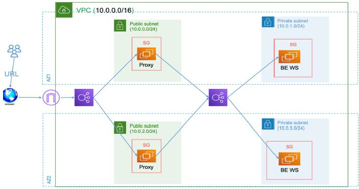

<p align="center">
  
</p>

<p align="center">
  
  
  
</p>

# 🚀 Project Name

🛠️ Built with **Terraform** and **AWS**  
💻 Infrastructure as Code for Cloud Deployment  
🔒 Designed for System Administrators

---

## 📌 Table of Contents

- [📖 Overview](#-overview)
- [📦 Features](#-features)
- [⚙️ Requirements](#️-requirements)
- [🚀 Getting Started](#-getting-started)
- [📁 Project Structure](#-project-structure)
- [🔧 Key Variables](#-key-variables)
- [🧑‍💻 Author](#-author)

---

## 📖 Overview

This project uses **Terraform** to provision a complete cloud infrastructure on **AWS**, including VPC, subnets, EC2 instances, public/private Load Balancers, and more. The architecture is fully modular for easy maintenance and scalability.

---

## 📦 Features

- ✅ Fully automated infrastructure
- ✅ Public & Private Subnets
- ✅ Organized modular structure
- ✅ Auto-generated IP addresses file
- ✅ Internal and external ALBs

---

## ⚙️ Requirements

| Tool         | Recommended Version |
|--------------|---------------------|
| Terraform    | >= 1.5              |
| AWS CLI      | >= 2.0              |
| Linux        | Preferred           |
| AWS Account  | Required            |

---

## 🚀 Getting Started

```bash
# 1. Clone the repository
git clone https://github.com/mu7adiab/Final_Terraform_Project.git
cd Final_Terraform_Project

# 2. Initialize Terraform
terraform init

# 3. Preview the execution plan
terraform plan

# 4. Apply the configuration
terraform apply
```

---

## 📁 Project Structure

```bash
.
terraform-sohag/
│
├── main.tf
├── backend.tf
├── variables.tf
├── outputs.tf
├── README.md
├── all-ips.txt
│
└── modules/
    ├── vpc-m/
    ├── subnet-m/
    ├── sg-m/
    ├── igw-m/
    ├── ec2-public-m/
    ├── ec2-private-m/
    ├── alb-public-m/
    └── alb-private-m/
    ├── networking-m/
```

---

## 🔧 Key Variables

| Variable         | Description                        |
|------------------|------------------------------------|
| `vpc_cidr`       | CIDR block for the main VPC        |
| `public_subnets` | List of public subnets             |
| `private_subnets`| List of private subnets            |
| `instance_type`  | Type of EC2 instances              |
| `key_name`       | SSH key name for instance access   |

---


## 🧑‍💻 Author

- **’Muhammad Diab**
- GitHub: [@mu7adiab](https://github.com/mu7adiab))

---

